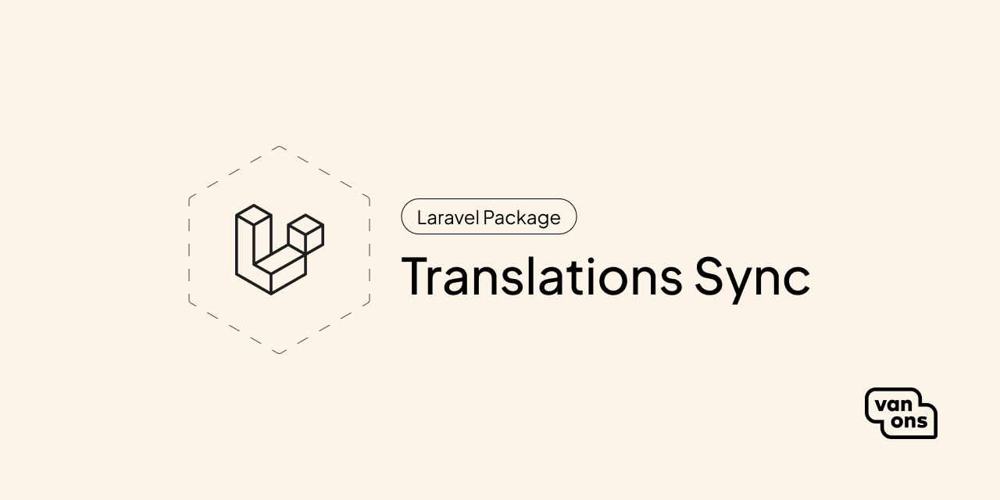

<p align="center"></p>

# Laravel Translations Sync

[](https://github.com/VanOns/laravel-translations-sync/releases)
[](https://packagist.org/packages/van-ons/laravel-translations-sync)
[](https://github.com/VanOns/laravel-translations-sync/issues)
[](https://github.com/VanOns/laravel-translations-sync/blob/main/LICENSE.md)

A package that synchronizes translations between your Laravel project and a provider.

## Quick start

First, install the package via Composer as dev dependency:

```bash
composer require van-ons/laravel-translations-sync --dev
```

Then, publish the configuration file:

```bash
php artisan vendor:publish --tag="translations-sync-config"
```

Next, follow the [configuration steps](docs/installation.md#configuration) to set up the configuration file and providers.

### Usage

You can execute the synchronization command by running:

```bash
php artisan lang:sync
````

See [Basic usage](docs/basic-usage.md) for more information.

## Documentation

Please see the [documentation] for detailed information about installation and usage.

## Contributing

Please see [contributing] for more information about how you can contribute.

## Changelog

Please see [changelog] for more information about what has changed recently.

## Upgrading

Please see [upgrading] for more information about how to upgrade.

## Security

Please see [security] for more information about how we deal with security.

## Credits

We would like to thank the following contributors for their contributions to this project:

- [All Contributors][all-contributors]

## License

The scripts and documentation in this project are released under the [GPL-3.0 License][license].

---

<p align="center"><a href="https://van-ons.nl/" target="_blank"></a></p>

[documentation]: docs/README.md
[contributing]: CONTRIBUTING.md
[changelog]: CHANGELOG.md
[upgrading]: UPGRADING.md
[security]: SECURITY.md
[email]: mailto:opensource@van-ons.nl
[all-contributors]: ../../contributors
[license]: LICENSE.md
