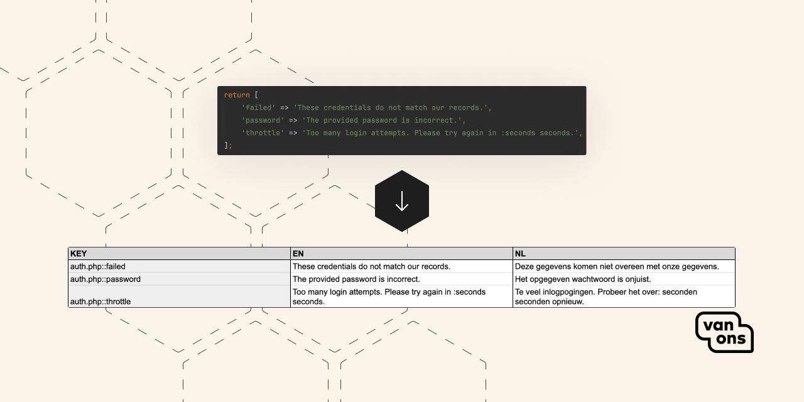

<p align="center"></p>

# Google Sheets

You can sync the translations with [Google Sheets](https://sheets.google.com).

## Setup

To use Google Sheets as a sync provider, follow these steps:

### Service account

1. Create a service account in the [Google Cloud Console](https://console.cloud.google.com/iam-admin/serviceaccounts).
2. Download the JSON key file to the directory of your choice. Note down the path to the file.

### Google Sheets

1. Create a Google Sheets document.
2. Set up a header row with the following columns (case-insensitive):
   1. `key`: This will contain the translation key. Use a descriptive name, such as `KEY`.
   2. `base_locale`: This will contain the base locale. For example: `EN`.
   3. *Add columns for all the locales you want to support.*
3. Share the Google Sheets document with the service account email address and give it edit permissions.
4. Note the following information:
   1. The Google Sheets document ID from the URL: `https://docs.google.com/spreadsheets/d/{ID}/edit`.
   2. The name of the sheet. E.g., `Sheet1`.
   3. The first column letter. E.g., `A`.
   4. The last column letter. E.g., `C`.
   5. The heading row number. E.g., `1`.
   6. The first row number. E.g., `2`.
   7. The heading cell value for the key column. E.g., `KEY`.
   8. The heading cell value for the base translation column. E.g., `EN`.

### Configuration

Add the following configuration to your `.env` file:

```dotenv
LTS_SYNC_PROVIDER=google_sheets
LTS_GOOGLE_SHEETS_AUTH_CONFIG="path/to/service-account.json"
LTS_GOOGLE_SHEETS_SPREADSHEET_ID=aabbccdd11223344
LTS_GOOGLE_SHEETS_SHEET_NAME=Sheet1
LTS_GOOGLE_SHEETS_FIRST_COLUMN=A
LTS_GOOGLE_SHEETS_LAST_COLUMN=C
LTS_GOOGLE_SHEETS_HEADING_ROW=1
LTS_GOOGLE_SHEETS_FIRST_ROW=2
LTS_GOOGLE_SHEETS_KEY_CELL_VALUE=KEY
LTS_GOOGLE_SHEETS_BASE_TRANSLATION_CELL_VALUE=EN
```

---

Congratulations! You have successfully set up Google Sheets as the sync provider.
